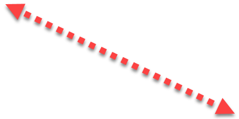

<html lang="en">
	<head>
		<meta charset="utf-8">
		<meta name="viewport" content="width=device-width, initial-scale=1, shrink-to-fit=no">
		<meta http-equiv="x-ua-compatible" content="ie=edge">
		<meta name="msvalidate.01" content="89359D9C492A475C0061398008D105FB" />
		
		<!-- seo !-->
		<meta name="description" content="Html Agility Pack | HAP">
		<meta name="keywords" content="">
		<title>Html Agility Pack | HAP</title>
		
		<!-- icon/css !-->
		<link rel="icon" type="image/png" href="images/logo.png">
		<link rel="stylesheet" href="https://maxcdn.bootstrapcdn.com/bootstrap/4.0.0-alpha.6/css/bootstrap.min.css" integrity="sha384-rwoIResjU2yc3z8GV/NPeZWAv56rSmLldC3R/AZzGRnGxQQKnKkoFVhFQhNUwEyJ" crossorigin="anonymous" />
		<link rel="stylesheet" type="text/css" href="https://maxcdn.bootstrapcdn.com/font-awesome/4.4.0/css/font-awesome.min.css">
	</head>

   <body>
	<header>
	
		<!-- navbar !-->
		<section id="navbar" class="fixed-top">
			<nav class="container navbar navbar-toggleable-md">
			
				<!-- menu mobile !-->
				<button class="navbar-toggler navbar-toggler-right" type="button" data-toggle="collapse" data-target="#navbar-menu" aria-controls="navbar-menu" aria-expanded="false" aria-label="Toggle navigation">
					
				</button>

				<!-- brand !-->
				

					<a href="http://html-agility-pack.net/">
						
						Html Agility Pack (HAP)
					</a>
				

				
				<!-- menu !-->
				
		
					<ul class="navbar-nav">
						<li class="nav-item">
							<a class="nav-link" href="tutorials">Tutorials</a>
						</li>
						<li class="nav-item">
							<a class="nav-link" href="https://github.com/zzzprojects/html-agility-pack">GitHub</a>
						</li>
						<!--<li class="nav-item">
							<a class="nav-link" href="mailto:info@zzzprojects.com">Contact</a>
						</li>!-->
						<li class="nav-item nav-item-download">
							<a class="btn btn-danger btn-lg btn-download2" href="https://www.nuget.org/packages/HtmlAgilityPack/" target="_blank" role="button" onclick="ga('send', 'event', { eventAction: 'download'});"><i class="fa fa-cloud-download"></i>&nbsp;DOWNLOAD v1.4.9</a>
						</li>
					</ul>
				

				
			</nav>
		</section>
		
		

		

	
		<!-- hero !-->
		<section id="hero">
			

				

					

					
						<!-- hero-header !-->
						

						
							<!-- header !-->
							<h1>
								
HAP

								
Html Agility Pack

							</h1>
							
							<!-- download !-->
							
<a type="button" class="btn btn-danger btn-hero-download" href="https://www.nuget.org/packages/HtmlAgilityPack/" target="_blank">NuGet Download</a>

							
Download Count:

							

								3
								&nbsp;,&nbsp;
								9
								7
								9
								&nbsp;,&nbsp;
								9
								0
								9
							

						

						
					

					
					

					
						<!-- hero-examples !-->
						

						
							<!-- example 1 !-->
							

								
LOAD &  PARSE HTML

								

							

							

								

								
C# HTML Parser Examples

<pre>
// From File
var doc = new HtmlDocument();
doc.Load(filePath);

// From String
var doc = new HtmlDocument();
doc.LoadHtml(html);

// From Web
var url = "http://html-agility-pack.net/";
var web = new HtmlWeb();
var doc = web.Load(url);</pre>
								

							

						

						

						
							<!-- example 2 !-->
							

								
USE  SELECTORS,  TRAVERSORS,  MANIPULATORS,  & MORE

								

							

							

								

								
C# HTML Selectors Examples

<pre>
// With XPath	
var value = doc.DocumentNode
	.SelectNodes("//td/input")
	.First()
	.Attributes["value"].Value;
	
// With LINQ	
var nodes = doc.DocumentNode.Descendants("input")
	.Select(y => y.Descendants()
	.Where(x => x.Attributes["class"].Value == "box"))
	.ToList();</pre>
								

							

						

					

				

			

			
		</section>
		
	</header>

	

		<!-- Testimonials !-->
		<section id="testimonials">
			

				<h2 class="section-header"><i class="fa fa-heart text-red" aria-hidden="true"></i>&nbsp;By Millions!</h2>
				<h3>Discover why thousands of developers around the world use Html Agility Pack</h3>

				

					

					
						

							

								<h3 class="card-title">FREE & Open Source</h3>
							

							<a href="https://github.com/zzzprojects/html-agility-pack"><i class="fa fa-github fa-5x"></i></a>
							

								
Want to contribute? Access to the full source and help us by providing a pull request.

								<a href="https://github.com/zzzprojects/html-agility-pack" target="_blank">GitHub</a>
							

						

					

					

						
						

							

								<h3 class="card-title">Stack Overflow Support</h3>
							

							<a href="https://stackoverflow.com/questions/tagged/html-agility-pack"><i class="fa fa-weixin fa-5x"></i></a>
							

								
Have a question? Ask questions and find answers from over 2500 questions.

								<a href="https://stackoverflow.com/questions/tagged/html-agility-pack" target="_blank">Stack Overflow</a>
							

						

					

				

			
				

					

					
						

							

								<h3 class="card-title">Tutorials & Examples</h3>
							

							<a href="http://html-agility-pack.net/tutorials"><i class="fa fa-folder-open fa-5x"></i></a>
							

								
Need help to getting started? Find answers you need through tutorials and online examples.

								<a href="tutorials">Tutorials</a>
							

						

						
						
					

					

						
						

							

								<h3 class="card-title">Issue Tracker</h3>
							

							<a href="https://github.com/zzzprojects/html-agility-pack/issues"><i class="fa fa-users fa-5x"></i></a>
							

								
Found a bug? Have suggestion? Report it and get support from our professional team.

								<a href="https://github.com/zzzprojects/html-agility-pack/issues">Issues</a>
							

						

						
					

				

				

			

		</section>

		<section id="features">
			<h2>Getting Started - HTML Agility Pack</h2>
		
			

			
				<!-- feature 1 !-->
				

					

						<h3>HTML Parser</h3>
						
Load and parse HTML

						<ul>
							<li><a href="http://html-agility-pack.net/parser">From File</a></li>
							<li><a href="http://html-agility-pack.net/parser">From String</a></li>
							<li><a href="http://html-agility-pack.net/parser">From Web</a></li>				
						</ul>
						
						
<a href="parser" type="button" class="btn btn-primary">Html Parser Tutorials</a>

					

					
					

						

							
C#HTML Parser Examples

<pre>
// From File
var doc = new HtmlDocument();
doc.Load(filePath);

// From String
var doc = new HtmlDocument();
doc.LoadHtml(html);

// From Web
var url = "http://html-agility-pack.net/";
var web = new HtmlWeb();
var doc = web.Load(url);</pre>
					
						

					

				

				<!-- splitter !-->
				

				
				<!-- feature 2 !-->
				

					

						<h3 style="padding-left: 10px;">HTML Selectors</h3>
						
Select HtmlNode, Element, and Attributes:

						<ul>
							<li><a href="http://html-agility-pack.net/selectors">XPATH</a></li>
							<li><a href="http://html-agility-pack.net/selectors">CSS <i>Coming Soon</i></a></li>		
							<li><a href="http://html-agility-pack.net/selectors">XDocument</a></li>
							<li><a href="http://html-agility-pack.net/selectors">LINQ</a></li>							
						</ul>
						
						
<a href="selectors"  type="button" class="btn btn-primary">HTML Selectors Tutorials</a>

					
	
					
					

						

							
C#HTML Selectors Examples

<pre>
// With XPath	
var value = doc.DocumentNode
	.SelectNodes("//td/input")
	.First()
	.Attributes["value"].Value;
	
// With LINQ	
var nodes = doc.DocumentNode.Descendants("input")
	.Select(y => y.Descendants()
	.Where(x => x.Attributes["class"].Value == "box"))
	.ToList();</pre>

						

					

				

				<!-- splitter !-->
				

				<!-- feature 3 !-->
				

				
					

						<h3>HTML Manipulation</h3>
						
Manipulate HtmlNode, Element, and Attributes:

						<ul>
							<li><a href="http://html-agility-pack.net/manipulation">AppendChild</a></li>
							<li><a href="http://html-agility-pack.net/manipulation">CreateNode</a></li>
							<li><a href="http://html-agility-pack.net/manipulation">InsertAfert</a></li>				
							<li><a href="http://html-agility-pack.net/manipulation">PreprendChild</a></li>
						</ul>
						
						
<a href="manipulation" type="button" class="btn btn-primary">HTML Manipulation Tutorials</a>

					

					
					

						

							
C#HTML Manipulation Examples

<pre>
var doc = new HtmlDocument();
doc.LoadHtml(html);

// InnerHtml	
var innerHtml = doc.DocumentNode.InnerHtml;

// InnerText	
var innerText = doc.DocumentNode.InnerText;</pre>
					
						

					
					
				

				<!-- splitter !-->
				

				<!-- feature 4 !-->
				

				
					

						<h3>HTML Traversing</h3>
						
Traverse HtmlNode, Element, and Attributes:

						<ul>
							<li><a href="http://html-agility-pack.net/traversing">ChildNodes</a></li>
							<li><a href="http://html-agility-pack.net/traversing">Descendants()</a></li>
							<li><a href="http://html-agility-pack.net/traversing">Elements()</a></li>
						</ul>		

						
<a href="traversing" type="button" class="btn btn-primary">HTML Traversing Tutorials</a>
			
					
	
					
					

						

							
C#HTML Traversing Examples

<pre>
var doc = new HtmlDocument();
htmlDoc.LoadHtml(html);

// Descendants	
var nodes = doc.DocumentNode.Descendants("input");
</pre>
					
						

					

				

				
			

			
			
			  
			
<a href="tutorials" type="button" class="btn btn-primary btn-lg">More Tutorials & Examples</a>
	
			   

		</section>

			

				

					

						<h3>Entity Framework</h3>
						<ul>
							<li><a href="http://entityframework-extensions.net/" target="_blank">Entity Framework Extensions</a></li>
							<li><a href="http://entityframework-plus.net/" target="_blank">Entity Framework Plus (EF+)</a></li>
						</ul>
					

					

						<h3>Performance</h3>
						<ul>
							<li><a href="http://bulk-operations.net/" target="_blank">Bulk Operations</a></li>
							<li><a href="http://dapper-plus.net/" target="_blank">Dapper Plus</a></li>
							<li><a href="http://dapper-tutorial.net/" target="_blank">Dapper Tutorial</a></li>
						</ul>
					

					

						<h3>Expression Evaluator</h3>
						<ul>
							<li><a href="http://eval-expression.net/" target="_blank">C# Eval Function()</a></li>
							<li><a href="http://eval-sql.net/" target="_blank">SQL Eval Function()</a></li>
						</ul>
					

					

						<h3>Utilities</h3>
						<ul>
							<li><a href="http://html-agility-pack.net/" target="_blank">HTML Agility Pack</a></li>
							<li><a href="https://github.com/zzzprojects/Z.ExtensionMethods" target="_blank">Extension Methods</a></li>							
						</ul>
					

				

			
		
		

		
		<footer>
			

				

					

						Copyright &copy; <a href="http://www.zzzprojects.com/" class="text-bold">ZZZ Projects Inc.</a> 2014 - 2017
						

						All rights reserved
					

					
					

					
					

						<a href="https://www.facebook.com/zzzprojects" target="_blank"><i class="fa fa-facebook"></i></a>
						<a href="https://twitter.com/zzzprojects" target="_blank"><i class="fa fa-twitter"></i></a>
						<a href="https://plus.google.com/+Zzzprojects_NetSQL" target="_blank"><i class="fa fa-google-plus"></i></a>
						<a href="http://zzzprojects.us9.list-manage.com/subscribe?u=cecbc4775cf67bf1ff82018af&amp;id=4765ffa5f8" target="_blank"><i class="fa fa-newspaper-o"></i></a>
					

				

			

		</footer>

		

	
    
    

</body>
</html>
