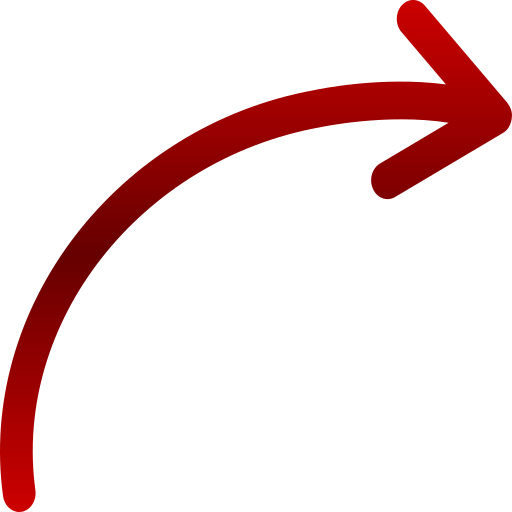

<html lang="en">
  <head>
  
	<!-- meta !-->
    <meta charset="utf-8">
    <meta name="viewport" content="width=device-width, initial-scale=1, shrink-to-fit=no">
	<meta name="msvalidate.01" content="89359D9C492A475C0061398008D105FB" />
	
	<!-- seo !-->
	<meta name="description" content="Html Agility Pack | HAP" />
	<meta name="keywords" content="" />
	<title>Html Agility Pack | HAP</title>
		
    <!-- stylesheet -->
	<link rel="stylesheet" href="https://maxcdn.bootstrapcdn.com/bootstrap/4.0.0-beta/css/bootstrap.min.css" integrity="sha384-/Y6pD6FV/Vv2HJnA6t+vslU6fwYXjCFtcEpHbNJ0lyAFsXTsjBbfaDjzALeQsN6M" crossorigin="anonymous">
	<link rel="stylesheet" type="text/css" href="https://maxcdn.bootstrapcdn.com/font-awesome/4.4.0/css/font-awesome.min.css" />
	<link rel="stylesheet" type="text/css" href="https://cdnjs.cloudflare.com/ajax/libs/animate.css/3.5.2/animate.min.css" />
	<link rel="stylesheet" type="text/css" href="css/style.css" />
	
	<!-- icon !-->
	<link rel="icon" type="image/png" href="http://entityframework-plus.net/images/logo.png" />
	
  </head>
  <body>
  

	<!-- header !-->
	<header class="fixed-top">

		<!-- navbar !-->
		<nav class="container navbar navbar-light navbar-expand-lg">

			<!-- brand !-->
			<a class="navbar-brand" href="{{ site.github.url }}/">
				
				Html Agility Pack (HAP)
			</a>
		
			<!-- menu mobile !-->
			<button class="navbar-toggler" type="button" data-toggle="collapse" data-target="#navbar-menu" aria-controls="navbar-menu" aria-controls="navbar-menu" aria-expanded="false" aria-label="Toggle navigation">
				
			</button>
			
			<!-- menu !-->
			
		
				<ul class="navbar-nav">
					<li class="nav-item">
						<a class="nav-link" href="{{ site.github.url }}/tutorials"><i class="fa fa-book" aria-hidden="true"></i>&nbsp;Tutorials</a>
					</li>
					<li class="nav-item">
						<a class="nav-link" href="https://github.com/zzzprojects/html-agility-pack"><i class="fa fa-github" aria-hidden="true"></i>&nbsp;GitHub</a>
					</li>
							<li class="nav-item">
								<a class="nav-link" href="http://www.zzzprojects.com/contribute" target="_blank"><i class="fa fa-users" aria-hidden="true"></i>&nbsp;Donate</a>
							</li>	
					<li class="nav-item">
						<a class="nav-link" href="{{ site.github.url }}/contact-us"><i class="fa fa-envelope" aria-hidden="true"></i>&nbsp;Contact</a>
					</li>
					<li class="nav-item nav-item-download">
						<a class="btn btn-lg btn-z" href="https://www.nuget.org/packages/HtmlAgilityPack/" role="button" onclick="ga('send', 'event', { eventAction: 'download'});"><i class="fa fa-cloud-download" aria-hidden="true"></i>&nbsp;&nbsp;Download&nbsp;<i class="fa fa-angle-right"></i></a>
					</li>
				</ul>
			
				
		</nav>

	</header>
	
	<!-- particules !-->
	

		

			<canvas class="particles-js-canvas-el" style="width: 100%; height: 100%;" width="1903" height="969"></canvas>
		

	

	
	<!-- hero !-->
	

		

			

			
				<!-- hero-header !-->
				

				
					<!-- header !-->
					<h1>
						
HAP

						
Html Agility Pack

					</h1>
					
					<!-- download !-->
					
<a class="btn btn-xl btn-z" href="https://www.nuget.org/packages/HtmlAgilityPack/" target="_blank">NuGet Download&nbsp;<i class="fa fa-angle-right"></i></a>

					
Download Count:

					

					
				

				
				<!-- hero-examples !-->
				

				
					<!-- example-1 !-->
					

					
						<!-- example-1-header !-->
						
 
							<h5>LOAD &amp; PARSE HTML</h5>
							

						

						
						<!-- example-1-code !-->
						

							

								
C# HTML Parser Examples

								

<pre>// From File
var doc = new HtmlDocument();
doc.Load(filePath);

// From String
var doc = new HtmlDocument();
doc.LoadHtml(html);

// From Web
var url = "http://html-agility-pack.net/";
var web = new HtmlWeb();
var doc = web.Load(url);</pre>
								

							

						

					

					
					<!-- example-2 !-->
					

					
						<!-- example-2-header !-->
						

							<h5>USE SELECTORS, TRAVERSORS, MANIPULATORS, &amp; MORE</h5>
							

						

						
						<!-- example-2-code !-->
						

							

								
C# HTML Selectors Examples

								

<pre>// With XPath	
var value = doc.DocumentNode
.SelectNodes("//td/input")
.First()
.Attributes["value"].Value;

// With LINQ	
var nodes = doc.DocumentNode.Descendants("input")
.Select(y =&gt; y.Descendants()
.Where(x =&gt; x.Attributes["class"].Value == "box"))
.ToList();</pre>
								

							

						
						
					

					
				

				
			

		
	
	

	
	<!-- keys !-->
	

		

		
			<!-- keys-header !-->
			

				<h2><i class="fa fa-heart text-z" aria-hidden="true" style="visibility: visible; animation-name: bounceInLeft;"></i>&nbsp;By Millions!</h2>
				<h3>Discover why thousands of developers around the world use Html Agility Pack</h3>
			

			
			

			
				<!-- key-1 !-->
				

					

						<i class="fa fa-github"></i>
						

							<h5>FREE &amp; Open Source</h5>
							
Want to contribute? Access to the full source and help us by providing a pull request.

							
<a href="https://github.com/zzzprojects/html-agility-pack" target="_blank">GitHub</a>

						

					
			
				

				
				<!-- key-2 !-->
				

					

						<i class="fa fa-weixin"></i>
						

							<h5>Stack Overflow Support</h5>
							
Have a question? Ask questions and find answers from over 2500 questions.

							
<a href="https://stackoverflow.com/questions/tagged/html-agility-pack" target="_blank">Stack Overflow</a>

						

					
	
				

			
				<!-- key-3 !-->
				

					

						<i class="fa fa-folder-open"></i>
						

							<h5>Tutorials &amp; Examples</h5>
							
Need help to getting started? Find answers you need through tutorials and online examples.

							
<a href="tutorials">Tutorials</a>

						

					
			
				

				
				<!-- key-4 !-->
				
	
					

						<i class="fa fa-bug"></i>
						

							<h5>Issue Tracker</h5>
							
Found a bug? Have suggestion? Report it and get support from our professional team.

							
<a href="https://github.com/zzzprojects/html-agility-pack/issues">Issues</a>

						

					
				
				

				
			
	
		

	 

	
	
	<!-- features !-->
	

		

			<h2>Getting Started - HTML Agility Pack</h2>

			
&nbsp;

			
&nbsp;

			
&nbsp;

			
			<!-- features-arrow !-->
			
1

			

			
			

			
<i class="fa fa-play" aria-hidden="true"></i>

			
			<!-- feature 1 !-->
			

			
				

					<h3>HTML Parser</h3>
					
Load and parse HTML

					<ul class="list-content">
						<li><a href="http://html-agility-pack.net/parser">From File</a></li>
						<li><a href="http://html-agility-pack.net/parser">From String</a></li>
						<li><a href="http://html-agility-pack.net/parser">From Web</a></li>				
					</ul>
					
					
<a href="parser" class="btn btn-z">Html Parser Tutorials</a>

				

				
				

				
						

						
C#&nbsp;HTML Parser Examples

						

<pre>// From File
var doc = new HtmlDocument();
doc.Load(filePath);

// From String
var doc = new HtmlDocument();
doc.LoadHtml(html);

// From Web
var url = "http://html-agility-pack.net/";
var web = new HtmlWeb();
var doc = web.Load(url);</pre>
						

					

				

			

				

				
2

				

				
<i class="fa fa-play" aria-hidden="true"></i>

				
				<!-- feature 2 !-->
				

					

						<h3>HTML Selectors</h3>
						
Select HtmlNode, Element, and Attributes:

						<ul class="list-content">
							<li><a href="http://html-agility-pack.net/selectors">XPATH</a></li>
							<li><a href="http://html-agility-pack.net/selectors">CSS <i>Coming Soon</i></a></li>		
							<li><a href="http://html-agility-pack.net/selectors">XDocument</a></li>
							<li><a href="http://html-agility-pack.net/selectors">LINQ</a></li>							
						</ul>
						
						
<a href="selectors" class="btn btn-z">HTML Selectors Tutorials</a>

					
	
					
					

						

							
C#&nbsp;HTML Selectors Examples

							

<pre>// With XPath	
var value = doc.DocumentNode
	.SelectNodes("//td/input")
	.First()
	.Attributes["value"].Value;
	
// With LINQ	
var nodes = doc.DocumentNode.Descendants("input")
	.Select(y =&gt; y.Descendants()
	.Where(x =&gt; x.Attributes["class"].Value == "box"))
	.ToList();</pre>
							

						

					

				

				

				
3

				

				
<i class="fa fa-play" aria-hidden="true"></i>

				<!-- feature 3 !-->
				

				
					

						<h3>HTML Manipulation</h3>
						
Manipulate HtmlNode, Element, and Attributes:

						<ul class="list-content">
							<li><a href="http://html-agility-pack.net/manipulation">AppendChild</a></li>
							<li><a href="http://html-agility-pack.net/manipulation">CreateNode</a></li>
							<li><a href="http://html-agility-pack.net/manipulation">InsertAfter</a></li>				
							<li><a href="http://html-agility-pack.net/manipulation">PreprendChild</a></li>
						</ul>
						
						
<a href="manipulation" class="btn btn-z">HTML Manipulation Tutorials</a>

					

					
					

						

							
C#&nbsp;HTML Manipulation Examples

							

<pre>var doc = new HtmlDocument();
doc.LoadHtml(html);

// InnerHtml	
var innerHtml = doc.DocumentNode.InnerHtml;

// InnerText	
var innerText = doc.DocumentNode.InnerText;</pre>
							

						

					
					
				

				

				
4

				

				
<i class="fa fa-play" aria-hidden="true"></i>

				
				<!-- feature 4 !-->
				

				
					

						<h3>HTML Traversing</h3>
						
Traverse HtmlNode, Element, and Attributes:

						<ul class="list-content">
							<li><a href="http://html-agility-pack.net/traversing">ChildNodes</a></li>
							<li><a href="http://html-agility-pack.net/traversing">Descendants()</a></li>
							<li><a href="http://html-agility-pack.net/traversing">Elements()</a></li>
						</ul>		

						
<a href="traversing" class="btn btn-z">HTML Traversing Tutorials</a>
			
					
	
					
					

						

							
C#&nbsp;HTML Traversing Examples

								

<pre>var doc = new HtmlDocument();
htmlDoc.LoadHtml(html);

// Descendants	
var nodes = doc.DocumentNode.Descendants("input");
</pre>
							

						

					

				

			

			

			
<i class="fa fa-play" aria-hidden="true"></i>

			
<a href="tutorials" class="btn btn-z btn-lg">More Tutorials &amp; Examples</a>

		

	

	
	<footer class="fixed-bottom">
		

			<a class="btn btn-social btn-facebook" href="https://www.facebook.com/sharer/sharer.php?u=http%3A%2F%2Fhtml-agility-pack.net%2F" target="_blank"><i class="fa fa-facebook" aria-hidden="true"></i>&nbsp;Share on Facebook</a>
			&nbsp;
			<a class="btn btn-social btn-twitter" href="https://twitter.com/intent/tweet?url=http%3A%2F%2Fhtml-agility-pack.net%2F&text=Check out this C# library Html Agility Pack:" target="_blank"><i class="fa fa-twitter" aria-hidden="true"></i>&nbsp;Share on Twitter</a>
		

	</footer>

    
    
    
	
	
	<!--!-->
	

  </body>
</html>
